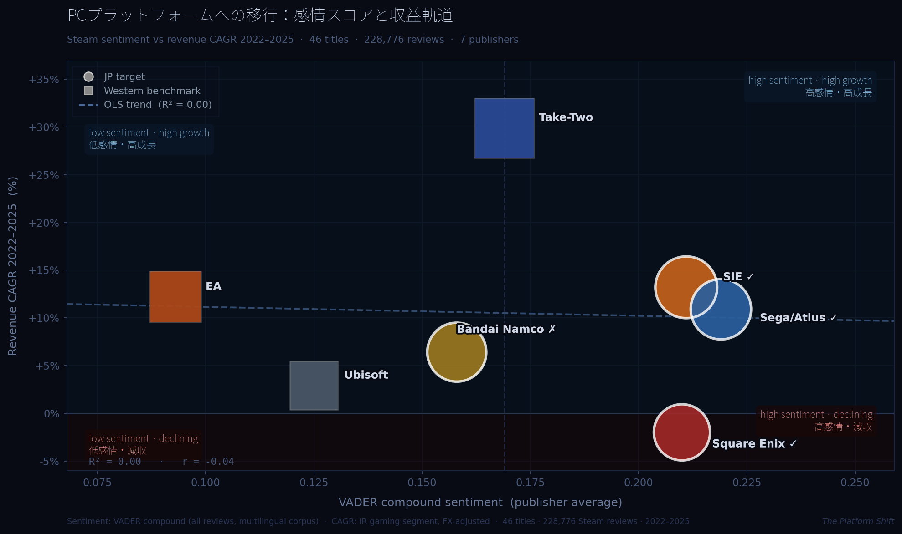
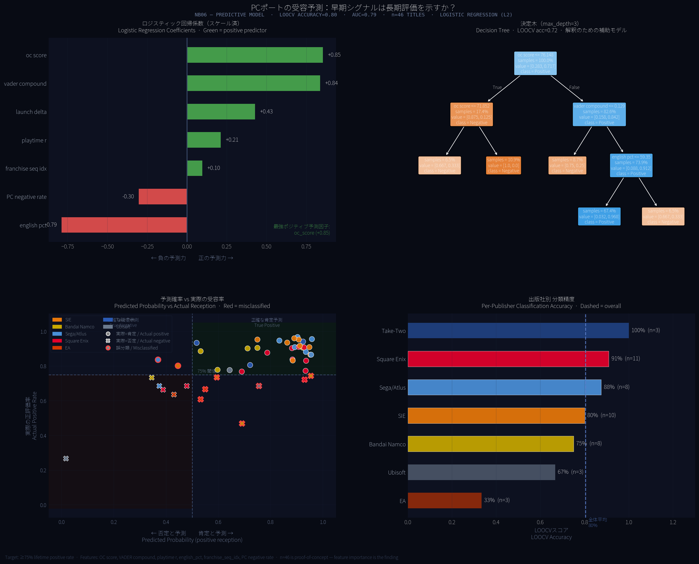

# The Platform Shift



<p align="center">
  <a href="https://ss-gaming-platform-shift.streamlit.app/">
    
  </a>
</p>

<p align="center">
  46タイトル · 228,776件のSteamレビュー · 日本パブリッシャー4社＋欧米ベンチマーク3社 · 2022–2025<br>
  <em>46 titles · 228,776 Steam reviews · 4 JP publishers + 3 Western benchmarks · 2022–2025</em>
</p>

---

## 🇯🇵 日本語

### 中心的な発見

PC移植の「量」は収益軌道を予測しない（R²≈0.01）。移植の「質」が予測する。

強いフランチャイズと規律あるポーティング体制をPCに持ち込んだパブリッシャーは、測定可能で複利的な優位性を得ている。一方、PCを単なる追加流通チャンネルとして扱ったケースでは、成果にばらつきが見られる。

### パブリッシャー別の仮説と評価

| パブリッシャー | 仮説 | 評価 |
|------------|------|------|
| **SIE** | 組織的なポーティングは再現可能な制度的能力である | ✅ 確認 — 予想以上に強い |
| **バンダイナムコ** | エルデンリングがアニメIP→PCパイプラインを実証した | ❌ 逆説的 — 他タイトルへの波及が限定的 |
| **セガ/アトラス** | ペルソナは日本ゲーム業界で最も計画的なPCグローバル化を実行した | ✅ 確認 — 龍が如くシリーズの改善弧はさらに顕著 |
| **スクウェア・エニックス** | フランチャイズ疲弊がIR開示前にSteamデータで可視化できる | ✅ 確認 — ただし衰退ではなくばらつきが真のシグナル |

### 主要な分析結果

**SIE — 制度的な品質管理**
コーパス内の全SIEタイトルがOpenCritic 81以上を記録。4スタジオ、複数ジャンルにまたがる一貫した品質水準は、組織的能力を示唆する。コンソール→PCのリリース間隔は4年（God of War 2018）から2年未満（Ragnarök）に圧縮されており、品質基準は維持されている。

**バンダイナムコ — ポートフォリオ集中リスク**
エルデンリングがSteam総推薦数の75.1%を占める（HHI: 0.574）。同タイトルを除外するとカタログ平均ポジティブ率は77.5%に低下する。他IPラインナップ（テイルズ、ガンダム、ドラゴンボール）のPC実績はエルデンリングの水準に達していない。

**セガ/アトラス — 段階的グローバル化**
ペルソナシリーズは3つのPC作品にわたり安定した高評価を維持。龍が如くシリーズのリブランディングはコーパス内で最も顕著な感情値の改善弧を示した。この改善はSteamデータで先行的に観測可能だが、IR開示には遅れて反映される。

**スクウェア・エニックス — 品質のばらつき**
OC範囲：66.4（Forspoken）〜91.9（FF7 Rebirth）。標準偏差8.3はコーパス最大。高い実力を持ちながらもリリース間の品質差が大きく、ユーザーにとっての予測可能性が低い。Forspokenは批評家スコアでは最低値だが、プレイ時間と感情値の相関（r=+0.186）はコーパス最高であり、潜在的な支持層の存在を示す。

### 分析パイプライン

| 層 | モデル | サンプル | 目的 |
|----|--------|---------|------|
| 1 | VADER | 228,776件 | 全コーパス・全言語（英語辞書ベース） |
| 2 | DistilBERT | 22,796件 | 層化英語サンプル（高精度、サンプリング偏りあり） |
| 3 | Claude Haiku API | 2,270件 | 比例多言語サンプル（テーマ抽出＋PC特有シグナル） |

3層の感情分析によるクロスバリデーション。パブリッシャーランキングは全モデルで一貫しており、個別モデルの限界に関わらず集計結果の頑健性を確認。

### 予測モデル

ビジネス問い：ローンチ時点の指標でPC移植の長期的受容を予測できるか？

ロジスティック回帰（L2正則化、LOOCV）。精度0.80、AUC 0.79（多数決ベースライン0.717）。n=46は概念実証であり、精度よりも**特徴量重要度の序列**が主要な発見。

最も強い正の予測因子はOCスコア（批評家合意）とVADER複合値（プレイヤー感情）。最も強い負の予測因子はPC特有ネガティブ率であり、移植品質が受容に対する測定可能なリスク要因であることを示す。

---

## 🇬🇧 English

### Central Finding

PC port volume does not predict revenue trajectory (R² ≈ 0.01). Port quality does.

Publishers who brought strong franchises and disciplined porting processes to PC gained measurable, compounding advantages. Those who treated PC as an additional distribution channel saw inconsistent results.

### Publisher Theses

| Publisher | Thesis | Verdict |
|-----------|--------|---------|
| **SIE** | Systematic porting is a replicable institutional capability | ✅ Confirmed |
| **Bandai Namco** | Elden Ring validated an anime IP-to-PC pipeline | ❌ Inverted — limited spillover to other titles |
| **Sega/Atlus** | Persona executed a sustained PC globalisation strategy across multiple franchises | ✅ Confirmed — Like a Dragon arc even more pronounced |
| **Square Enix** | Franchise fatigue is visible in Steam data before IR filings | ✅ Confirmed — variance, not decline, is the real signal |

### Key Analytical Results

**SIE — Consistent quality across the portfolio.**
Every SIE title in the corpus scored above OC 81, across four studios and multiple genres. The console-to-PC release window compressed from four years (God of War 2018) to under two (Ragnarök) without a drop in reception scores.

**Bandai Namco — Elden Ring concentration risk.**
Elden Ring accounts for 75.1% of Bandai Namco's total Steam recommendations (HHI: 0.574). Excluding it, the catalogue's average positive rate falls to 77.5%. The remaining IP lineup — Tales, Gundam, Dragon Ball — has not reached comparable PC reception.

**Sega/Atlus — Improving over time.**
The Persona franchise holds sustained high sentiment across three PC entries. The Like a Dragon rebranding produced the strongest improving sentiment arc in the corpus — an improvement visible in Steam data before it appears in IR filings.

**Square Enix — High variance.**
OC range: 66.4 (Forspoken) to 91.9 (FF7 Rebirth). Standard deviation of 8.3, the widest in the corpus. Forspoken sits at the bottom on critic scores, but records the highest playtime-sentiment correlation (r = +0.186) — a dedicated audience that the launch execution and port quality failed to reach.

### Sentiment Pipeline

Three tiers of sentiment analysis. Publisher-level rankings are consistent across all three models.

| Tier | Model | Sample | Scope |
|------|-------|--------|-------|
| 1 | VADER | 228,776 reviews | Full corpus, all languages — English-only lexicon |
| 2 | DistilBERT | 22,796 reviews | Stratified English sample — higher accuracy, known sampling artifact |
| 3 | Claude Haiku API | 2,270 reviews | Proportional multilingual sample — theme extraction + pc_specific signal |

### Predictive Model

**Business question:** Can launch-window signals predict whether a PC port will achieve positive long-term reception?

Logistic Regression (L2, LOOCV). Accuracy 0.80, AUC 0.79 (vs 0.717 majority-class baseline). At n=46 this is a proof-of-concept — the **feature importance ranking** is the primary finding, not the accuracy figure.

Strongest positive predictors: OC score and VADER compound. Strongest negative predictor: PC-specific negative commentary rate — port quality is a measurable risk factor for long-term reception.


*特徴量重要度と出版社別LOOCV精度*

---

## Data Architecture

| Source | Coverage | Notes |
|--------|----------|-------|
| Steam Reviews API | 228,776 reviews, 46 titles, all languages | Cursor-paginated, newest-first — launch windows undersampled for high-volume titles |
| Steam App Details API | 46/46 titles | `recommendations` field used for HHI — uncapped total positive reviews |
| OpenCritic API (RapidAPI) | 46/46 titles | Key required — free tier, ~100 req/day limit |
| IR Annual Reports | 7 publisher groups, 2022–2025 | Gaming segment level — PC-specific revenue not disclosed |

---

## Key Metrics

**Launch Quality Delta** — steady-state positive rate minus first-30-day rate. Positive values indicate recovery after a difficult launch; negative values indicate fading initial reception.

**Playtime-Sentiment Correlation** — Pearson r between `author_playtime_forever` and VADER compound per title (English reviews, 99th percentile cap). Positive r suggests advocates deepen engagement; negative r suggests playtime burnout.

**Console→PC Gap** — days between original console release and Steam launch. Core cadence metric for SIE's porting strategy.

**HHI (Franchise Concentration)** — Herfindahl-Hirschman Index on Steam `recommendations` per publisher. Values above 0.25 indicate significant concentration around one or two titles.

**pc_specific Signal** — Claude API semantic tagging of whether each review explicitly comments on the PC version (`yes_positive` / `yes_negative` / `not_mentioned`). The ratio of negative to positive PC-specific mentions is the port quality signal.

---

## Tracked Titles (46)

**SIE (10):** God of War (2018), God of War Ragnarök, Horizon Zero Dawn, Horizon Forbidden West, Spider-Man Remastered, Spider-Man: Miles Morales, The Last of Us Part I, Helldivers 2, Returnal, Ratchet & Clank: Rift Apart

**Bandai Namco (8):** Elden Ring, Tekken 8, Dragon Ball FighterZ, Dragon Ball: Sparking! Zero, Ace Combat 7, Tales of Arise, Gundam Breaker 4, Little Nightmares II

**Sega/Atlus (8):** Like a Dragon: Infinite Wealth, Yakuza: Like a Dragon, Persona 3 Reload, Persona 4 Golden, Persona 5 Royal, Sonic Frontiers, Sonic Superstars, Two Point Campus

**Square Enix (11):** FF7 Remake Intergrade, FF7 Rebirth, FF XVI, FF XIV Online, Dragon Quest XI S, Octopath Traveler, Octopath Traveler II, NieR: Automata, NieR Replicant, Forspoken, Marvel's Avengers

**Benchmarks (9):** EA Sports FC 24, EA Sports FC 25, Apex Legends, GTA V, Red Dead Redemption 2, Borderlands 3, Assassin's Creed Mirage, Assassin's Creed Shadows, Star Wars Outlaws

*Nintendo excluded — no Steam presence.*

---

## Notebook Map

| Notebook | Purpose | Key Output |
|----------|---------|------------|
| NB01 | Steam extraction & validation | 228,776 reviews, 46 titles |
| NB02 | IR financial extraction | Revenue CAGR by publisher group, FX-adjusted |
| NB03 | Publisher & platform analysis | Port timing cadence, console→PC gap |
| NB04 | Sentiment analysis | VADER + DistilBERT + Claude API three-tier pipeline |
| NB05 | Franchise intelligence | Launch delta, playtime-sentiment r, HHI |
| NB06 | Predictive model | Logistic regression, LOOCV, feature importance |
| NB07 | Recommendations | Strategic recommendation per publisher |
| `app.py` | Streamlit dashboard | [Live dashboard →](https://ss-gaming-platform-shift.streamlit.app/) |

---

## Known Limitations

- Steam API returns reviews newest-first; launch window reviews are undersampled for older high-volume titles at the 5k review cap
- DistilBERT uses 50/50 stratified sampling; absolute scores are unreliable but publisher-level rankings hold
- Predictive model at n=46 is a proof-of-concept, not a production-grade predictor
- IR revenue data is at gaming segment level; PC-specific revenue is not publicly disclosed
- JPY/USD moved approximately 30% over the study period; CAGR figures are directional
- OpenCritic RapidAPI free tier is rate-limited to approximately 100 requests per day

---

## Environment

```bash
conda env create -f environment.yml
conda activate platform_shift
python -m ipykernel install --user --name platform_shift --display-name "Platform Shift"
jupyter lab
```

- `torch==2.3.1+cpu` — pinned to avoid DLL conflicts on Windows CPU environments
- `transformers==4.40.0`, `tokenizers==0.19.1`, `safetensors==0.4.3` — pinned
- CSV used throughout — pyarrow conda/pip conflict in this environment; no analytical impact
- OpenCritic API key: add `RAPIDAPI_KEY=your_key` to `.env` before running NB06

---

*Analysis by Stanley Shi · [LinkedIn](https://www.linkedin.com/in/stanley-shi-7b604b104/) · 2026*
